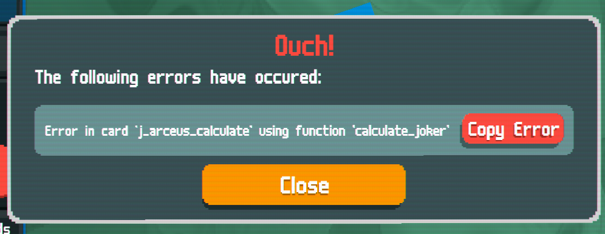
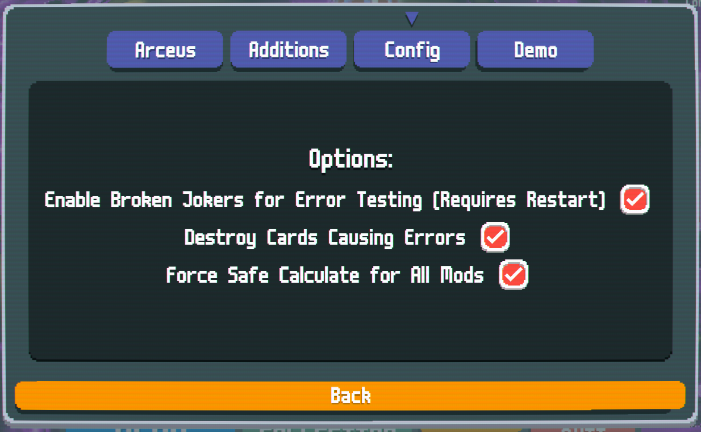
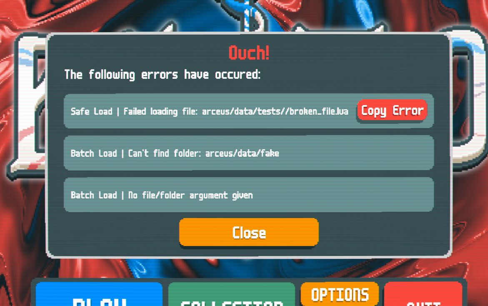
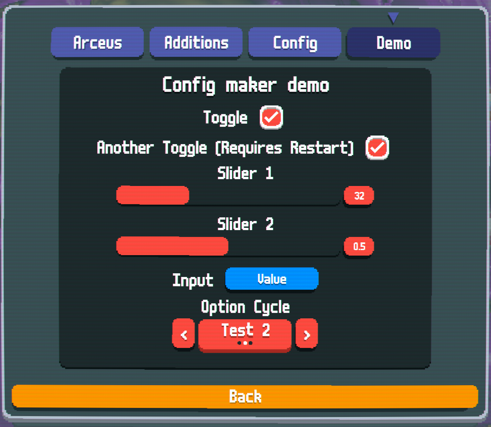

# Arceus (Libary/Utility Mod)

## About 
This is a library/utility mod that adds:
- Safe and batch loading files
- Auto loading all data files (including semi-automatic crossmod detection)
- Optional error handling for joker functions
- Error UI that provides full tracebacks (currently only for the features mentioned above)
- Config menu maker (needs a few adjustments currently)
- [NOT FULLY IMPLEMENTED] Menu UI popup queue
- [NOT FULLY IMPLEMENTED] Easier menu hook system
- [PLANNED] Centralised achievement menu

This is primarily for developers to reduce disruption during testing playtesting.

## Disclaimer

This mod is untested, so ironically this may cause crashes I haven't thought of.
If you encounter any problems, contact me on Discord at `cheekyrotter` (you can add me or ping me from the official Arceus thread in the modding forum on the Balatro server).

## For Users

Currently, mods can decide if they want to use the "safe calculate" options, on their cards, however you can forcefully enable it for all cards from the Arceus configuration menu.





## For Developers

I will work on documentation soon, but for now here is a list of available functions. Each have full LSP definitions for Visual Studio Code, which while provide full descriptions and autocomplete for each entry.

```lua
Arceus.add_menu_hook(func)
Arceus.add_menu_popup(ui, name)
Arceus.make_overlay(ui)
Arceus.safe_load(name)
Arceus.batch_load(folder, in_data)
Arceus.auto_load()
Arceus.create_config_tab(entries, settings)
```

The settings for your mod can be configured as follow (the default settings if left unchanged):

```lua
SMODS.current_mod.arceus_config {
    data_folder = "data/",
    crossmod_folder = "crossmod/",
    crossmod_in_data = true,
    auto_load_exclude = {},
    safe_calc = true
}
```

Crossmod loading works by reading each folder name (e.g. crossmod/Cryptid/) and checking if the corresponding mod is loaded.

File loading errors appear as follows:




Config menus are made as follows:

```lua
Arceus.create_config_tab({
    {type = "toggle", label = "Enable Broken Jokers for Error Testing", key = "testing_mode", restart = true},
    {type = "toggle", label = "Destroy Cards Causing Errors", key = "remove_cards"},
    {type = "toggle", label = "Force Safe Calculate for All Mods", key = "force_safe"},
})

Arceus.create_config_tab({
    {type = "toggle", label = "Toggle", key = "toggle_1"},
    {type = "toggle", label = "Another Toggle", key = "toggle_2", restart = true},
    {type = "slider", label = "Slider 1", key = "slider_1", config = {max = 100, min = 0}},
    {type = "slider", label = "Slider 2", key = "slider_2", config = {max = 1, min = 0, places = 1}},
    {type = "input", label = "Input", key = "input"},
    {type = "cycle", label = "Option Cycle", key = "cycle", cycles = {"Test 1", "Test 2", "Test 3"}},
},
{label = "Demo", description = "Config maker demo", table = Arceus.config.dummy_config})
```

This would result in the config menu earlier and the following:




It currently supports toggles, sliders, cycles, and text inputs (WARNING: text inputs are currently not functional and I cannot figure out why, will fix later), as well as extra tabs and using custom tables in place of normal config. Visual customisation options will come later. 